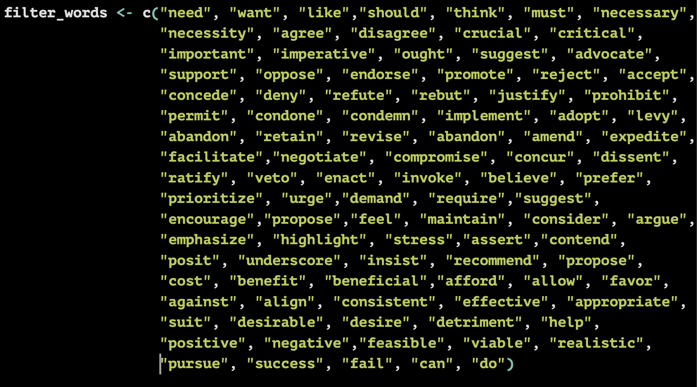
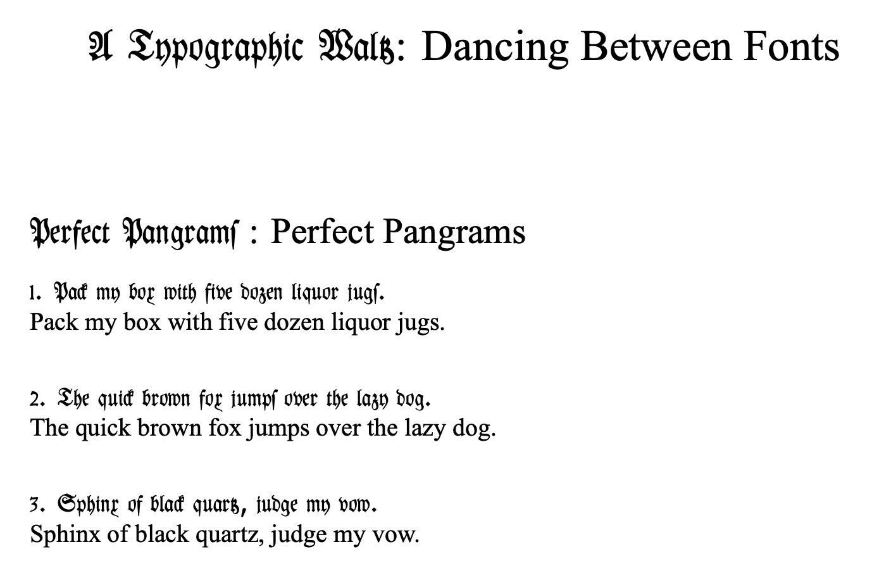

Below are selected R and LaTeX/Overleaf snippets I share for teaching, replication, and reuse. Each item has:
- a quick **preview image**
- a short description
- **download links** for the source files

---

## R Code

### Pulling text and data mining via a dictionary and outputing as a CSV file

{width=420}

This code pulls relevant paragraphs/sentences from PDFs and exports them to a CSV for viewing and coding. Helpful when you have large amounts of texts to filter!

**Downloads:**  
<a class="btn btn-sm btn-download" href="code/textfilter.R" download>
  Download filter text R script
</a>

---

## LaTeX — Overleaf Project

### A fun template for learning to read and write with Fraktur font

{width=420}

A LaTeX template from my Fraktur font Overleaf project. The live version is viewable on Overleaf, and you can download the .tex source or compiled PDF below.

**Links & downloads:**  
<a class="btn btn-sm" href="https://www.overleaf.com/read/dypbxxbcsncx#3ed488" target="_blank" rel="noopener">View on Overleaf</a>  
<a class="btn btn-sm btn-download" href="code/latex/main.tex" download>Download .tex</a>  
<!-- <a class="btn btn-sm btn-download" href="files/main.pdf" download>Download PDF</a> -->
---
