# 🎨 Art

::: gallery

<figure>

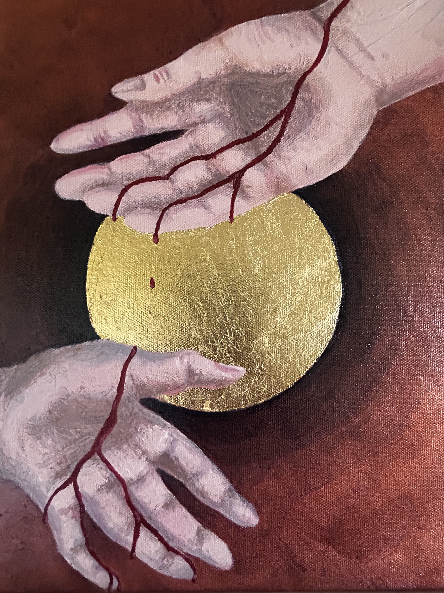

<figcaption>Oil and gold leaf on canvas (2025). </figcaption>

</figure>

<figure>

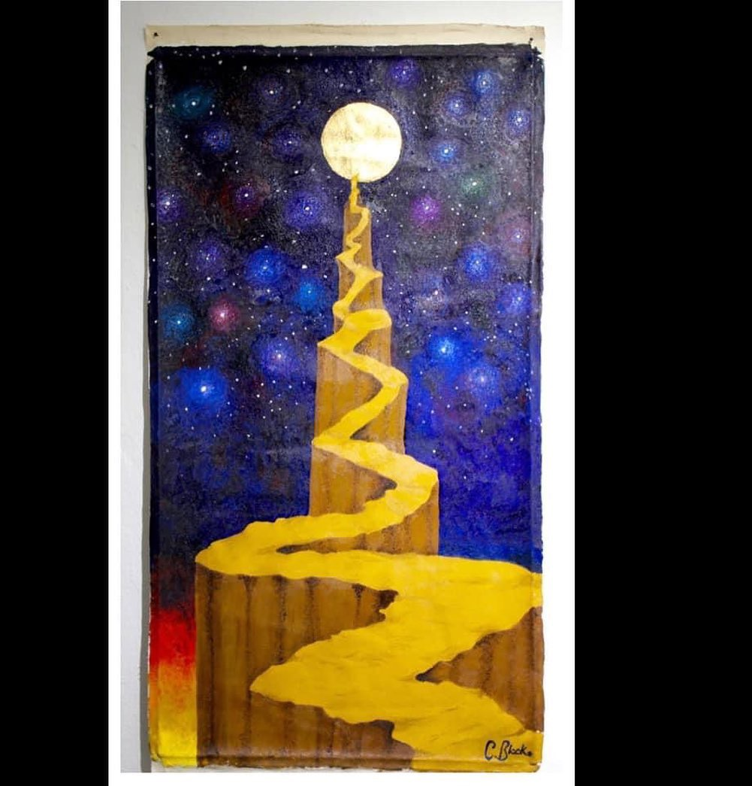

<figcaption>Oil and gold leaf on linen (2014). </figcaption>

</figure>

<figure>

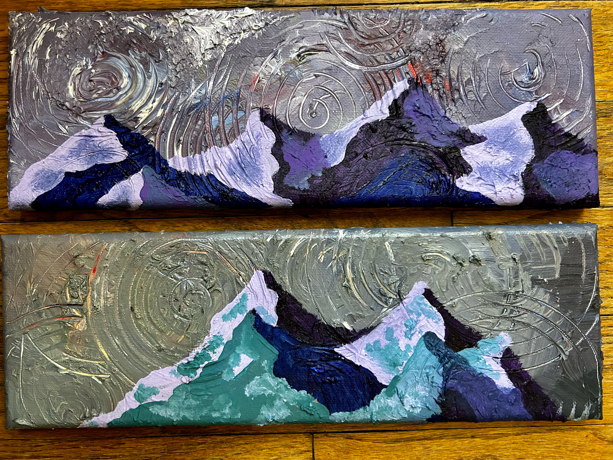

<figcaption>Acrylic on canvas (2024).</figcaption>

</figure>

<figure>

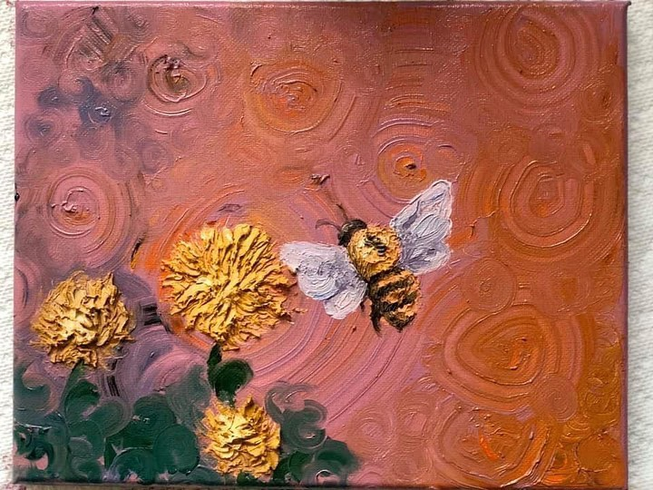

<figcaption>Acrylic on canvas (2019).</figcaption>

</figure>

<figure>

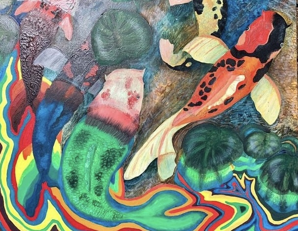

<figcaption>Oil on canvas (2017).</figcaption>

</figure>

<figure>

<figcaption>Oil and modeling paste on wood (2023).</figcaption>

</figure>

<figure>

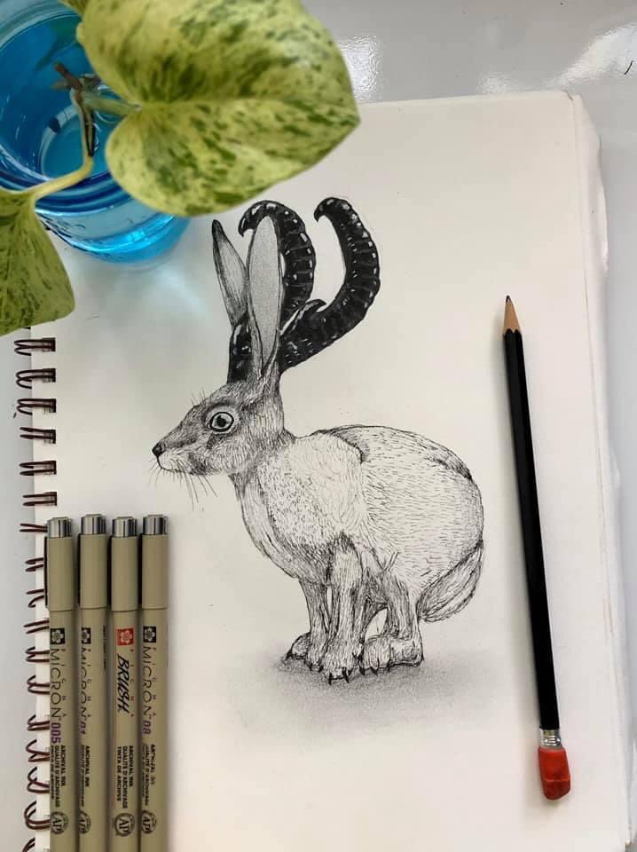

<figcaption>Micron pen and graphite on parchment (2019).</figcaption>

</figure>

<figure>

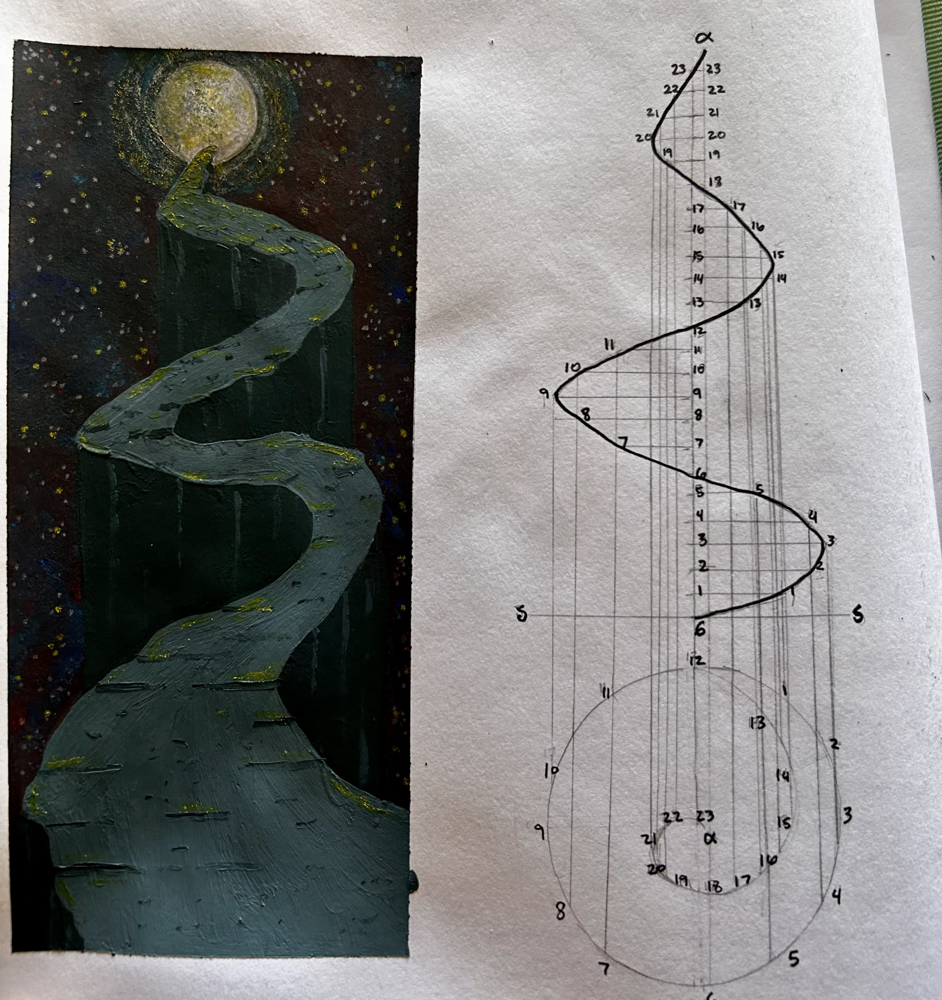

<figcaption>Gouache and micron pen on parchment (2024).</figcaption>

</figure>

<figure>

<figcaption>Prismacolor pencil on parchment (2025).</figcaption>

</figure>

<!-- Add more paintings as needed -->
:::

------------------------------------------------------------------------

# 📸 iNaturalist Photos

::: gallery
<figure>

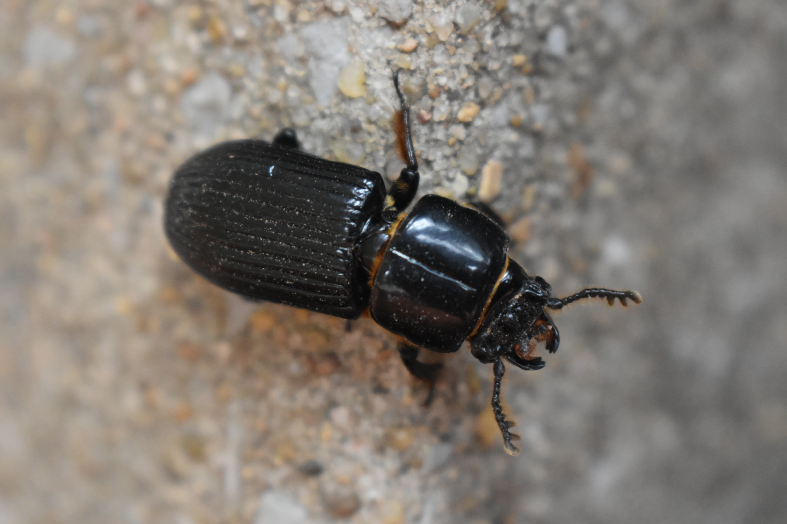

<figcaption>Horned Passalus Beetle Oklahoma</figcaption>

</figure>

<figure>

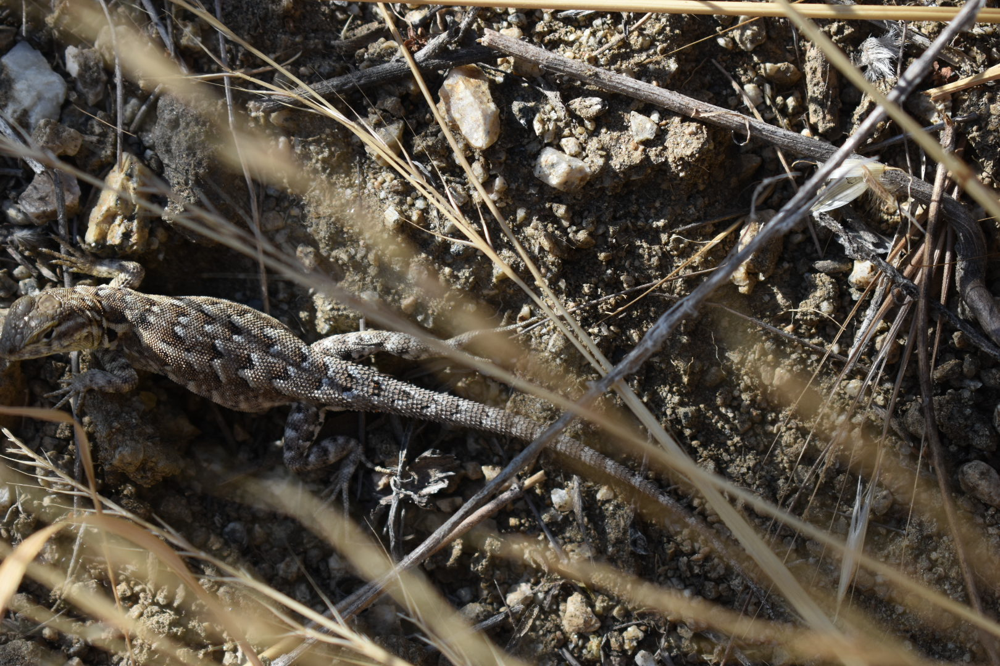

<figcaption>Western Side-Blotched Lizard in California</figcaption>

</figure>

<figure>

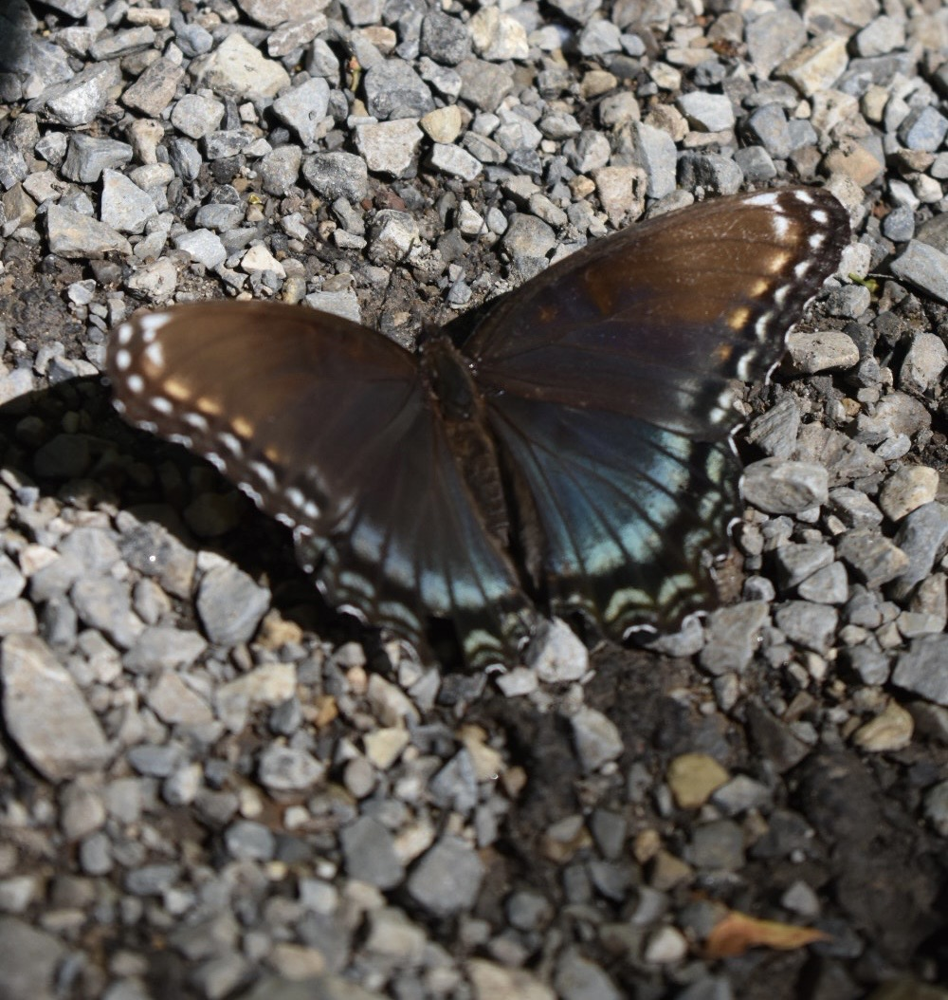

<figcaption>Red-spotted Admiral in Virgina</figcaption>

</figure>

<figure>

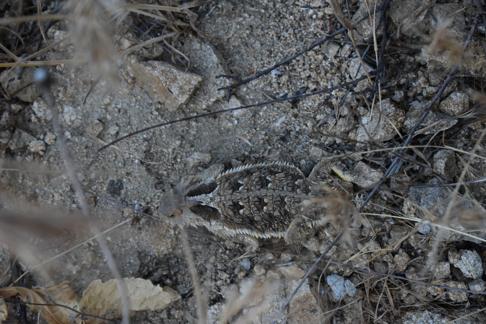

<figcaption>Blainville's Horned Lizard in California</figcaption>

</figure>

<figure>

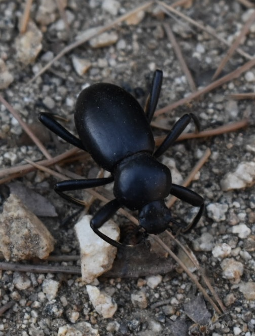

<figcaption>Coelocnemis magna in California</figcaption>

</figure>

<figure>

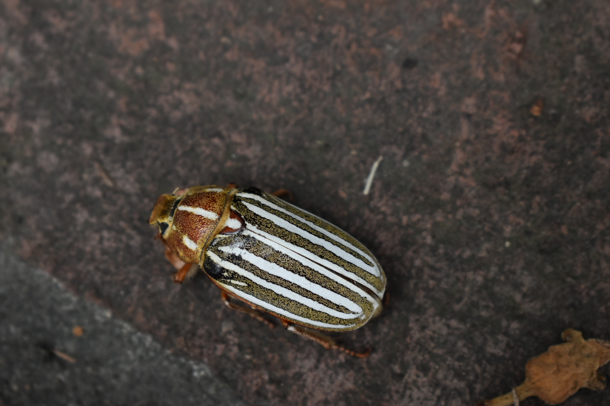

<figcaption>Ten-lined June Beetle in California</figcaption>

</figure>

<figure>

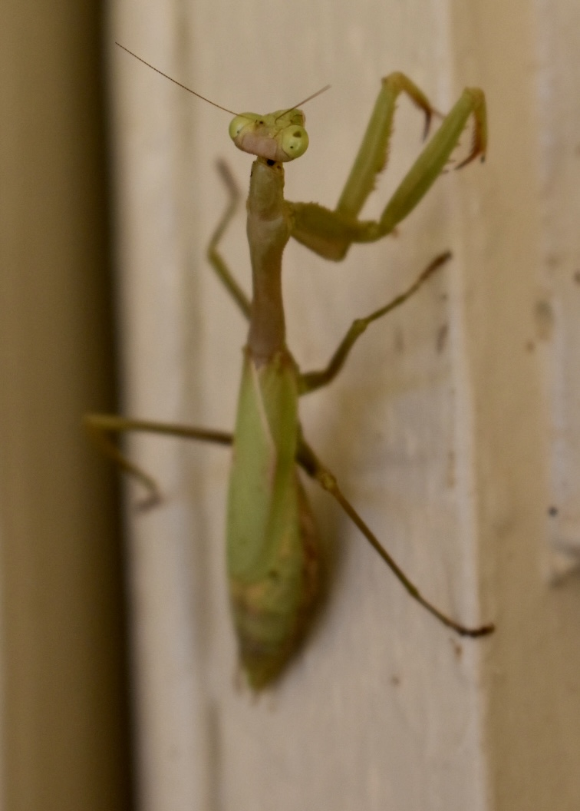

<figcaption>Carolina Mantis in Oklahoma</figcaption>

</figure>

<figure>

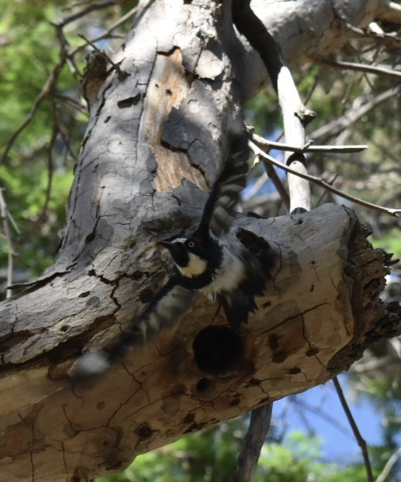

<figcaption>Acorn Woodpecker in California</figcaption>

</figure>

<figure>

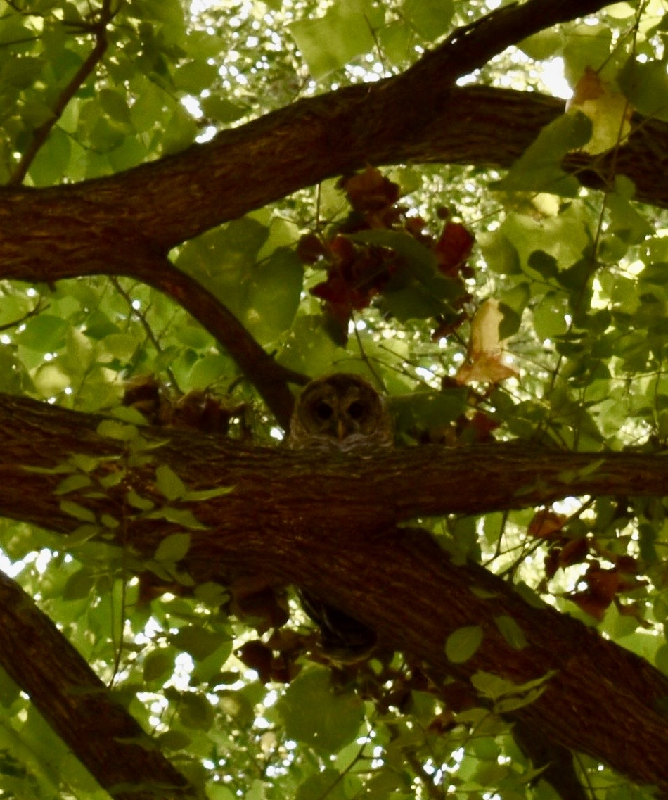

<figcaption>Barred Owl in Oklahoma</figcaption>

</figure>

<!-- Add more iNaturalist photos as needed -->
:::
