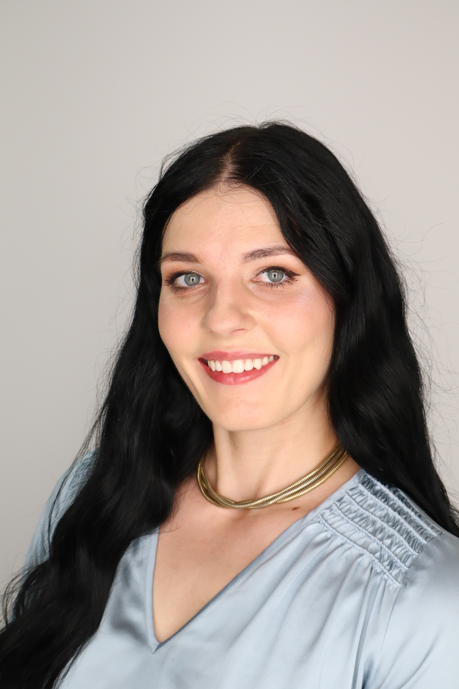

<!-- Centered title -->

  Hello, and welcome!

<!-- Headshot -->

{width="200px" style="border-radius: 12px; display:block; margin: 0 auto;"}

<!-- Name -->

::: {style="text-align:center; font-weight:bold; font-size:1.2em; margin-top:8px;"}
Cheyenne A. Black
:::

<!-- Social Links (Horizontal) -->

::: {style="margin-top:10px; text-align:center;"}
<a href="https://twitter.com/Cheyenne_A_B" target="_blank" rel="noopener">Twitter/X</a>  \|  <a href="https://www.linkedin.com/in/cheyenne-black0000/" target="_blank" rel="noopener">LinkedIn</a>  \|  <a href="https://orcid.org/0000-0002-6496-6619" target="_blank" rel="noopener">ORCID</a>  \|  <a href="https://www.researchgate.net/profile/Cheyenne-Black-2" target="_blank" rel="noopener">ResearchGate</a>
:::

<!-- Centered contact info -->

  
<strong>I hope you have a great day!</strong>

  
📧 <a href="mailto:cheyenne.alise.black@ou.edu">cheyenne.alise.black@ou.edu</a>

------------------------------------------------------------------------

I’m a PhD candidate at the University of Oklahoma studying **space, environmental, and science/technology policy**.

I’m a political scientist using **NLP, network analysis, and computational text methods** to study policy processes—especially in the evolving domain of space. I’ve worked with the RAND Corporation, the U.S. Department of State, and the Institute for Public Policy Research and Analysis on projects spanning space and aerospace policy, environmental governance, risk communication, and national security.

Outside academia I’m active in citizen science efforts by photographing and documenting wildlife locations and I enjoy oil painting, hiking, and museum wandering.

------------------------------------------------------------------------

## Highlights

-   **Latest:** See *Publications* for new papers, preprints, and accepted articles.
-   **Students:** Office hours and syllabi are on *Teaching*.
-   **In Progress:** Drafts and ongoing projects live under *Working Papers*.
-   **Code:** Selected analysis and visualization examples are in *Code*.
-   **For Fun:** Unrelated work projects and hobbies are in *For Fun*.

------------------------------------------------------------------------

<!-- Centered closing line -->

  I hope you have a great day!

