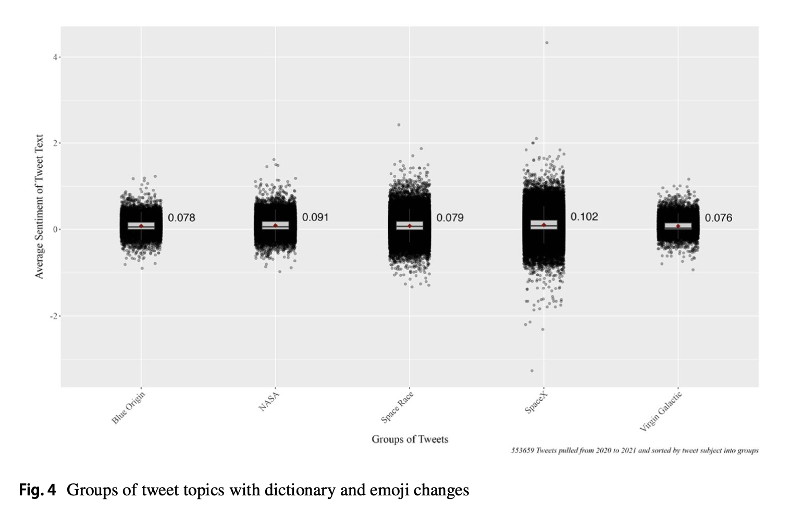
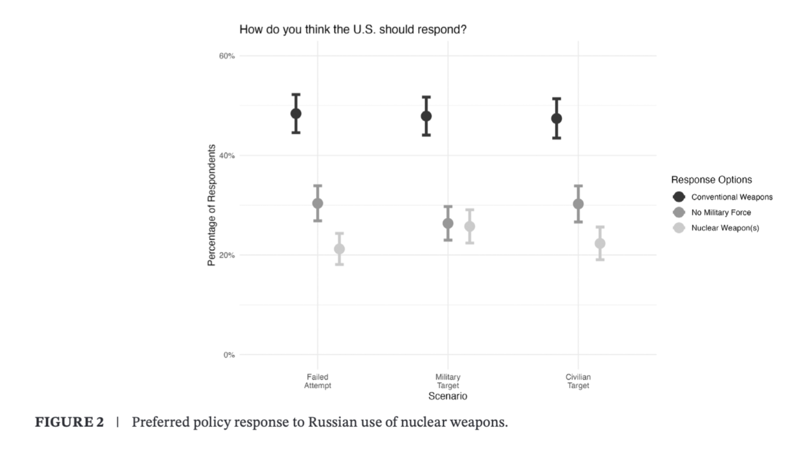
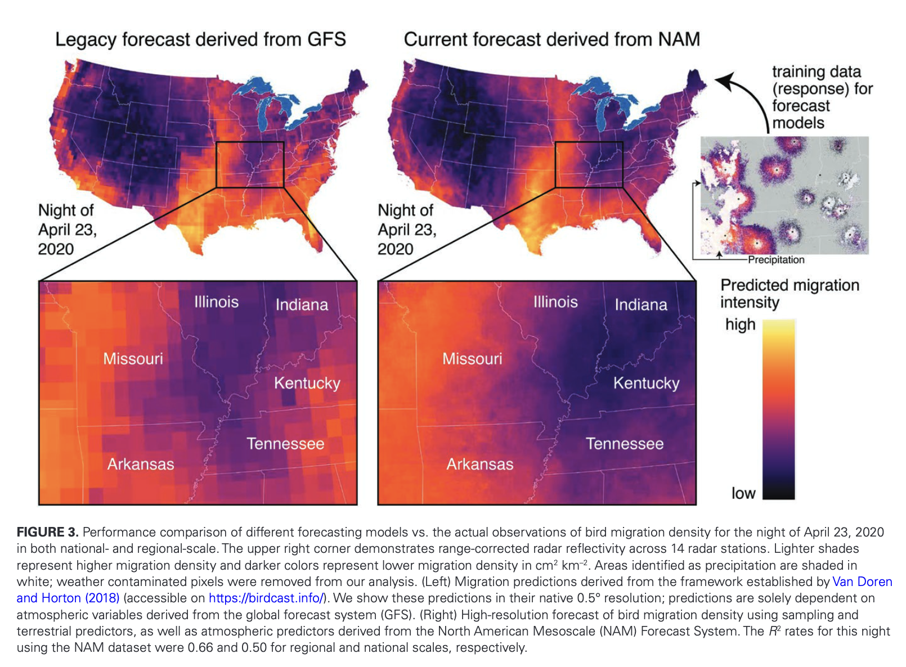

> If you're looking for downloadable PDFs of any articles, please visit the ResearchGate links provided or email me.

## Peer-Reviewed & Preprint Manuscripts

**Astro-nots Bezos, Branson, and Musk compared to NASA: promises and pitfalls of using sentiment analysis to assess differences between commercial, government, and public–private space missions**\
*Cheyenne A. Black*\
*2025 — Manuscript / Preprint in Quality and Quantity*

  

In recent years, commercial entities have increased their efforts in space. As the divide between traditional government and private entities’ involvement in space continues to grow, public opinion data measuring differences in perceptions between commercial, public–private partnership, and government space missions remain limited. This study addressed this gap by using dictionary-based sentiment analysis on 553,659 posts on X (formerly known as Twitter) to examine how perceptions of commercial missions and a SpaceX public–private partnership compared to NASA’s mission. Initial results indicated that the Blue Origin New Shepard Rocket, Virgin Galactic VSS Unity Rocket, and SpaceX Dragon 2 missions, along with the general topic of a billionaire space race, elicited more negative sentiments compared to NASA’s Mars Perseverance Rover mission. After editing the sentiment dictionary to account for contextual language, these results became more consistent across observed groups and demonstrated better model fit, with NASA still being viewed more positively compared to its commercial counterparts. Additionally, emoji conversion to text form affected the intensity of some sentiment values, though this impact was less pronounced than contextual dictionary edits. Overall, this study highlights the importance of sentiment attribution edits to contextual words when using dictionary-based sentiment analysis to assess public opinion.

[Read on ResearchGate](https://www.researchgate.net/publication/393322667_Astro-nots_Bezos_Branson_and_Musk_compared_to_NASA_promises_and_pitfalls_of_using_sentiment_analysis_to_assess_differences_between_commercial_government_and_public-private_space_missions)

---

**American Public Opinion on U.S. Responses to Russia’s Nuclear Threats in Ukraine**\
*Kaitlin Peach, Andrew Fox, Kuhika Gupta, Joseph Ripberger, Cheyenne Black, Tristan Winkle, Hank Jenkins-Smith*\
*2024 — Manuscript / Global Policy*

  

Since Russia's invasion of Ukraine in February 2022, President Vladimir Putin's nuclear threats have reshaped the global nuclear landscape, potentially altering public attitudes toward nuclear deterrence and weapons use. This article examines American preferences for United States responses—nuclear, conventional, or nonmilitary—to three hypothetical scenarios involving Russia's potential use of nuclear weapons against Ukraine. Drawing on data from the 2022 National Security Survey by the Institute for Public Policy Research and Analysis, we find that the American public generally favors conventional military responses over nuclear options, even in the face of increased nuclear threats. Qualitative analysis reveals that respondents primarily apply a “logic of consequences,” prioritizing strategic military utility over ethical or normative concerns when considering responses. These findings have significant implications for US nuclear policy and the theoretical discourse on nuclear nonuse.

[Read on ResearchGate](https://www.researchgate.net/publication/390548426_American_Public_Opinion_on_US_Responses_to_Russia's_Nuclear_Threats_in_Ukraine)

---

**Integrating multi-scale terrestrial and atmospheric predictors enhances nocturnal bird migration forecasts**\
*Miguel F. Jimenez, Ali Khalighifar, Carolyn S. Burt, Cheyenne A. Black, Maggie Leόn-Corwin, Andrew S. Fox, Hank C. Jenkins-Smith, Carol L. Silva, Grace E. Trankina, Jeffrey F. Kelly, and Kyle G. Horton*\
*2025 — Manuscript / Ornithological Applications*

  

Our ability to forecast the spatial and temporal patterns of ecological processes at continental scales has drastically improved over the past decade. Yet, predicting ecological patterns at broad scales while capturing fine-scale processes is a central challenge of ecological forecasting given the inherent tension between grain and extent, whereby enhancing one often diminishes the other. We leveraged 10 years of terrestrial and atmospheric data (2012–2021) to develop a high-resolution (2.9 × 2.9 km), radar-driven bird migration forecast model for a highly active region of the Mississippi flyway. Based on the suite of candidate models we examined, adding terrestrial predictors improved model performance only marginally, whereas spatially distant atmospheric predictors, particularly air temperature and wind speed from focal and distant regions, were major contributors to our top model, explaining 56% of variation in regional migration activity. Among terrestrial predictors, which ranked considerably lower than atmospheric predictors in terms of variable importance, vegetation phenology, artificial light at night, and percent of forest cover were the most important predictors. Furthermore, we scale this model to demonstrate the capacity to generate real-time, high-resolution forecasts for the continental United States that explained up to 65% of national variation. Our study demonstrates an approach for increasing the resolution of migration forecasts, which could facilitate the integration of radar with other data sources and inform dynamic conservation efforts at a local scale that is more relevant to threats, such as anthropogenic light at night.

[Read on ResearchGate](https://www.researchgate.net/publication/388927152_Integrating_multi-scale_terrestrial_and_atmospheric_predictors_enhances_nocturnal_bird_migration_forecasts)
